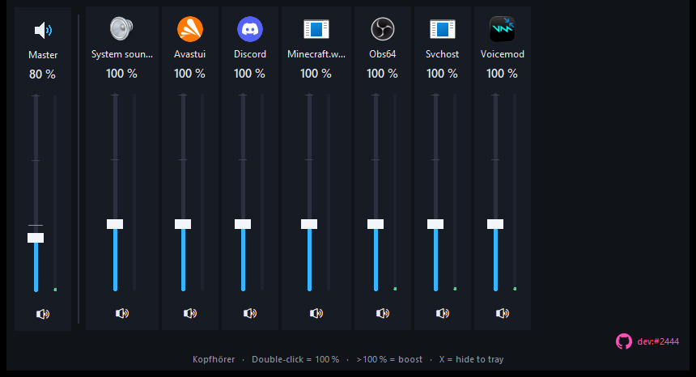

# LautMixer

**A Windows volume mixer whose sliders go up to 300 %.**

---

Like the real Windows volume mixer - one slider per app with icon, mute button and level meter - but every slider goes up to **300 %**. Everything above 100 % is the pink boost zone.

## What it does

- **Real boost per app** - no driver: the app's audio is captured with process loopback, the original session is set to 1/64 and the signal is amplified digitally (300 % is exactly 3.00x louder, measured).
- **Master slider** that boosts all apps at once, double-click resets a slider to 100 %.
- **Soft limiter** so loud boosts do not clip hard.
- **Lives in the tray** like Steam: the close button hides the mixer, boost keeps running.
- One small file - no installer, no dependencies.

## Download

Download **`LautMixer.exe`** from the [releases page](../../releases) or straight from this repository. Windows 10 (version 2004) or newer.

New to this? Follow **[SETUP-HELP.md](SETUP-HELP.md)** - it walks you through installing and starting it.

## How to use it

- Drag, click or use the mouse wheel to change a volume (it snaps to 100 %).
- Double-click a slider to jump back to 100 %.
- The speaker icon at the bottom mutes an app.
- Start with `LautMixer.exe --tray` to begin hidden in the tray.

## Notes

- While boosting, the Windows mixer shows the app at about 2 % - that is intentional (see above). Moving the slider back to 100 % or closing LautMixer restores everything.
- "System sounds" is capped at 100 % (no own process to capture).
- Only one instance at a time.

---

Made by **dev:#2444** - [github.com/hash2444](https://github.com/hash2444) - [lautmixer](https://github.com/hash2444/lautmixer)
